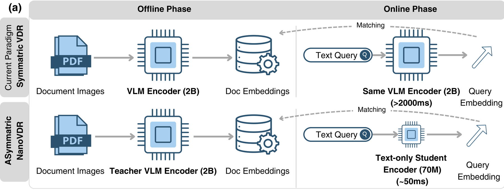

<p align="center">
  
</p>

<h3 align="center">Small retrievers for visual documents,<br>trained by aligning directly to a frozen VLM's embedding space</h3>

<p align="center">
  <a href="https://arxiv.org/abs/2603.12824"></a>
  <a href="https://arxiv.org/abs/2608.10636"></a>
  <a href="https://huggingface.co/nanovdr"></a>
  <a href="LICENSE"></a>
</p>

<p align="center">
  [[<a href="https://huggingface.co/nanovdr">Models</a>]]
  [[<a href="https://huggingface.co/spaces/nanovdr/NanoVDR-Demo">Demo</a>]]
  [[<a href="https://huggingface.co/blog/Ryenhails/nanovdr">Blog</a>]]
  [[<a href="https://huggingface.co/spaces/nanovdr/distilling-the-document-tower">Write-up</a>]]
  [[<a href="https://huggingface.co/datasets/nanovdr/NanoVDR-Train">Dataset</a>]]
</p>

---

## What this is

Visual document retrieval pairs a **text query** with a **document image**, with
no OCR in between. The models that do it well are 2B to 8B parameter
vision-language models. Running one over a corpus once is a cost you can plan
for. Running the *same* model on every query, forever, is not.

That asymmetry is the whole idea. A query is short text and carries no image, so
nothing about it needs a vision-language model at serving time -- only its
*embedding* has to land in the same space the pages were indexed into.

<p align="center">
  
</p>

**NanoVDR** trains a small student to put it there. A frozen VLM teacher encodes
the input once and the targets are cached; the student learns to reproduce that
representation, and the loss is a direct discrepancy between the two:

```
loss = discrepancy(student_representation, teacher_target)
```

No relevance labels, no negative mining, no contrastive sampling. Two
consequences follow, and they are what the rest of this repository is built on:

- **The two sides are independent.** Each tower only ever sees its own cached
  targets, so you can train either alone and pair it with the teacher for the
  other side.
- **The student inherits a space rather than learning one.** A student is only
  ever as good as the space it was aligned to, and it can only pair with models
  that live in that same space.

---

## The three families

| | Replaces the teacher at | Input | Output | Guide |
|---|---|---|---|---|
| **NanoVDR-Q** | query time | text | one vector | [docs/nanovdr-q.md](docs/nanovdr-q.md) |
| **NanoVDR-D** | indexing time | page image | one vector | [docs/nanovdr-d.md](docs/nanovdr-d.md) |
| **ColNanoVDR-Q** | query time | text | a set of vectors | [docs/colnanovdr-q.md](docs/colnanovdr-q.md) |

**NanoVDR-Q** is the main line and what the NanoVDR paper is about: a 69-151M
text encoder that reaches ~96% of a 2B teacher while answering a query in 51 ms
on one CPU thread.

**NanoVDR-D** is a branch, added in DistilVDR. It removes the teacher from
indexing as well, so a deployed pair has nothing multi-billion in it at all.

**ColNanoVDR-Q** carries the method to the multi-vector, late-interaction
retrievers that define the current state of the art. The query tower emits a
*set* of vectors in a ColPali-style teacher's space, so an existing multi-vector
page index is scored by MaxSim unchanged. Distillation there is **document-free**:
only the teacher's cached query token embeddings are consumed, never a page
image.

All checkpoints are on the Hub under
[**huggingface.co/nanovdr**](https://huggingface.co/nanovdr). Each guide above
carries that family's model table, results, usage and training recipe.

---

## How a model is named

```
[Col]NanoVDR-<Q|D>-<variant>-<teacher>-<width>[-ML]
```

| Field | Meaning |
|---|---|
| `Col` | multi-vector (late interaction). Absent means one vector per input. |
| `Q` / `D` | which side it replaces: query tower or document tower |
| `<variant>` | the backbone, or the tiling budget for a document tower |
| `<teacher>` | the frozen model whose embedding space this tower targets |
| `<width>` | the output dimension it was aligned at |
| `-ML` | trained on the multilingual mixture rather than English only |

**A pair is valid when the teacher and the width both match.** The teacher fixes
the embedding space; the width fixes which part of it is targeted, since a
Matryoshka teacher can be aligned to at more than one width. The variant and
`-ML` describe how a tower was built rather than where it lands, so they never
affect pairing. `Col` does: a multi-vector query tower scores page *token sets*
by MaxSim and cannot consume a single-vector index.

Concretely, there are three working configurations:

| | index pages with | query with | multi-billion model at serving |
|---|---|---|---|
| **NanoVDR** | Qwen3-VL-Embedding-2B | any `NanoVDR-Q-*-Qwen3VL2B-2048` | at indexing only |
| **DistilVDR** | `NanoVDR-D-*-Qwen3VL8B-4096` | `NanoVDR-Q-DistilBERT-Qwen3VL8B-4096-ML` | never |
| **ColNanoVDR** | the matching ColPali-style teacher | the `ColNanoVDR-Q-*` for that teacher | at indexing only |

Every model was renamed on 2026-08-11 to make this rule readable from the name.
The old links redirect and each model card records its former name.

---

## Install

```bash
pip install -e .          # add [train] or [eval] for the optional extras
```

## Quick start

Every released checkpoint runs straight from the Hub with no dependency on this
repository. One example per family; the guides have the rest.

**NanoVDR-Q** -- single vector, plain dot product.

```python
from sentence_transformers import SentenceTransformer

query = SentenceTransformer("nanovdr/NanoVDR-Q-DistilBERT-Qwen3VL2B-2048-ML")
q_emb = query.encode(["What was the revenue growth in Q3 2024?"])   # (1, 2048)

scores = q_emb @ doc_emb.T      # doc_emb from Qwen3-VL-Embedding-2B
```

**NanoVDR-Q + NanoVDR-D** -- both sides students, no teacher anywhere.

```python
from sentence_transformers import SentenceTransformer   # >= 5.4 for the document tower

query = SentenceTransformer("nanovdr/NanoVDR-Q-DistilBERT-Qwen3VL8B-4096-ML")
doc = SentenceTransformer("nanovdr/NanoVDR-D-HiRes-Qwen3VL8B-4096", trust_remote_code=True)

scores = query.encode(["..."]) @ doc.encode(pages).T
```

**ColNanoVDR-Q** -- multi vector, late interaction. Note the different class.

```python
from sentence_transformers import MultiVectorEncoder   # >= 6.0

query = MultiVectorEncoder("nanovdr/ColNanoVDR-Q-Ettin150M-ColQwen35-320-ML",
                           trust_remote_code=True)
q = query.encode_query(["What was the revenue growth in Q3 2024?"])

scores = query.similarity(q, page_embeddings)   # meanMaxSim, pages from the teacher
```

> Do not add an instruction prefix to any of these. The instruction is applied
> when the *teacher* targets are cached; the student is trained to reproduce
> that target from raw query text, and every published number was measured that
> way.

---

## Training

Every tower in this repository trains the same way, in two stages.

**1. Cache the teacher targets, once.** The teacher never runs during student
training, which is what lets towers train in parallel and what makes an
objective document-free when it consumes only query targets.

```bash
# single-vector teacher: one pooled vector per row
nanovdr-cache --data $DATA_ROOT/base_711k --out $CACHE_ROOT/teacher_8b/base_711k.h5 --kind image
nanovdr-cache --data $DATA_ROOT/queries   --out $CACHE_ROOT/teacher_8b/queries.h5   --kind query

# late-interaction teacher: a query token set per row, stored ragged
nanovdr-cache --data $DATA_ROOT/queries --out $CACHE_ROOT/colqwen35/queries.h5 \
    --kind query_tokens --teacher colqwen35
```

Caching the 1.20M-image and 1.49M-query mixture against the 8B teacher took
99.5 H200-GPU-hours. It is a one-time cost: every checkpoint and every ablation
reuses the same cache.

**2. Train a student against the cache.** One config schema, one loop; the
config decides which tower is instantiated and which objective is legal.

```bash
python -m nanovdr.train.query --config configs/query/distilbert_8b.yaml               # NanoVDR-Q
python -m nanovdr.train.query --config configs/query/ettin150m_colqwen35_otw.yaml     # ColNanoVDR-Q
torchrun --nproc_per_node=2 -m nanovdr.train.doc --config configs/doc/hires_8b.yaml   # NanoVDR-D
```

### Alignment objectives

The objective is the only place the method varies. `nanovdr/align/` holds one
registry for both geometries, because single-vector cosine alignment is the
one-atom case of the multi-vector set discrepancy:

| Key | Geometry | What it measures |
|---|---|---|
| `cosine` | single | `1 - <s, t>` between two points on the sphere |
| `ot` | multi | entropic Sinkhorn transport between two token measures on the sphere |

```python
from nanovdr.align import get_align_loss, available_align_losses

loss = get_align_loss("ot", geometry="multi", eps=0.05, n_iter=50, weighted=True)
available_align_losses(geometry="single")   # ['cosine']
```

With `weighted: true` the student marginal becomes a softmax over per-token
logits from the tower's weight head instead of a uniform one. That is the
objective the released ColNanoVDR towers train with (**OTW**), and
[docs/colnanovdr-q.md](docs/colnanovdr-q.md) explains what it buys.

Registering a new objective is one decorator; nothing else changes.

---

## Evaluation harness

`nanovdr-eval` reproduces **twelve publicly released retrievers plus the
teacher** under one protocol: same evaluation driver, same input formatting,
same deduplication, same metric code. It reports retrieval quality *and*
deployment cost side by side.

```bash
nanovdr-eval --doc-model nanovdr/NanoVDR-D-HiRes-Qwen3VL8B-4096 \
             --teacher-cache $CACHE_ROOT/teacher_8b/eval \
             --benchmarks v1 v2 v3 --out results.json
```

```python
from nanovdr.evaluation import profile_model
profile_model(doc_tower, pages, batch_size=8)
# {'pages_per_second': 36.82, 'peak_vram_gb': 3.07, 'index_gb_per_million': 16.4, ...}
```

Measured per model: NDCG@5 on ViDoRe v1/v2/v3, query latency, document
throughput, peak VRAM, index size per million documents, and CPU scoring latency
at 10K candidates.

The harness carries the per-baseline handling these models need to reproduce
their published behaviour: float32 for BiModernVBERT, the released chat-template
path with `use_cache=False` for DSE-Qwen2, the native flash-attention path for
InternViT, and so on. If you only take one thing from this repository, take
this.

---

## Repository layout

```
nanovdr/
├── align/            the objective registry; the only place the method varies
│   ├── registry.py     Repr, AlignLoss, get_align_loss
│   ├── single.py       cosine
│   └── multi.py        ot (Sinkhorn), optionally weighted
├── towers/
│   ├── query.py        text -> single vector or token set
│   ├── doc.py          page image -> single vector
│   ├── modeling_doc.py   standalone definition, also shipped inside every
│   │                     Hub checkpoint and loaded by trust_remote_code
│   └── processing_doc.py standalone image processor, likewise shipped; the
│                         one home for page tiling
├── heads.py          SingleVectorHead / MultiVectorHead
├── teacher.py        one-off target precomputation  (nanovdr-cache)
├── data.py           mixtures of datasets paired with cached targets
├── tiling.py         re-export of the tiling rule from processing_doc
├── scoring.py        dot product | MaxSim | meanMaxSim, dispatched on geometry
├── evaluation.py     ViDoRe scoring and deployment profiling  (nanovdr-eval)
├── config.py         YAML loading with ${VAR} expansion
└── train/
    ├── engine.py       the loop, shared by every tower
    ├── doc.py          entry point
    └── query.py        entry point
configs/              the released recipes
docs/                 one guide per model family
packaging/            training checkpoint -> Hub package, and its verifier
tests/                objective registry and preprocessing tests, no GPU needed
```

Two invariants are worth knowing about, because both are the kind of thing that
silently changes results rather than failing:

**Preprocessing lives in one place.** A page does not reach the model as one
448px view; it is cut into aspect-ratio-matched tiles plus a thumbnail,
zero-padded to a fixed budget and paired with a mask. That rule lives in
`processing_doc.py` alone so it cannot drift between training, evaluation and
release. `tests/test_processing.py` asserts the processor is bit-identical to
the preprocessing the released weights were trained on, across five page aspect
ratios.

**Every release is verified against its checkpoint.** Packaging rebuilds a
forward pass out of sentence-transformers modules, so `packaging/verify_*.py`
re-encodes the same inputs both ways and compares element-wise. A package that
would retrieve differently from the checkpoint its numbers were measured on is
a hard failure, not a warning.

---

## Papers and write-ups

| | What | Where |
|---|---|---|
| **NanoVDR** | The main line: a 70M text-only query tower distilled from a 2B teacher. Accepted to the EMNLP 2026 Main Conference. | [arXiv:2603.12824](https://arxiv.org/abs/2603.12824) · [blog](https://huggingface.co/blog/Ryenhails/nanovdr) |
| **DistilVDR** | The branch: adds the document tower, so both sides are students and the teacher is gone at deployment. | [arXiv:2608.10636](https://arxiv.org/abs/2608.10636) · [write-up](https://huggingface.co/spaces/nanovdr/distilling-the-document-tower) |
| **ColNanoVDR** | Multi-vector query towers by document-free transport alignment. Models released; paper in preparation. | [models](https://huggingface.co/nanovdr) |

## Citation

```bibtex
@article{nanovdr2026,
  title   = {NanoVDR: Distilling a 2B Vision-Language Retriever into a 70M
             Text-Only Encoder for Visual Document Retrieval},
  author  = {Liu, Zhuchenyang and Zhang, Yao and Xiao, Yu},
  journal = {arXiv preprint arXiv:2603.12824},
  year    = {2026}
}

@article{distilvdr2026,
  title   = {DistilVDR: A Compact End-to-End Visual Document Retriever
             via Dual-Student Distillation},
  author  = {Liu, Zhuchenyang and Wang, Ziyi and Zhang, Yao and Xiao, Yu},
  journal = {arXiv preprint arXiv:2608.10636},
  year    = {2026}
}
```

## Acknowledgements

This repository was built in collaboration with
[Claude](https://claude.com/claude-code) (Anthropic): the package structure, the
packaging and verification tooling, the test suite, and the documentation. The
experiments, the results, and every number reported here are our own.

## License

MIT for the code, and for every released checkpoint except two: the
`ColNanoVDR-Q-*-ColVec*` towers inherit the webAI Non-Commercial License from
their teacher and are **non-commercial only**, which their model cards and
`LICENSE.md` files state. Training data follows the licences of its respective
upstream sources.
