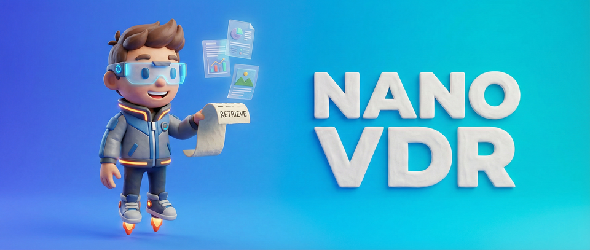

<p align="center">
  
</p>

<h3 align="center">Small retrievers for visual documents,<br>trained by aligning directly to a frozen VLM's embedding space</h3>

<p align="center">
  <a href="https://arxiv.org/abs/2603.12824"></a>
  <a href="https://arxiv.org/abs/2608.10636"></a>
  <a href="https://huggingface.co/nanovdr"></a>
  <a href="LICENSE"></a>
</p>

<p align="center">
  [[<a href="https://huggingface.co/nanovdr">Models</a>]]
  [[<a href="https://huggingface.co/spaces/nanovdr/NanoVDR-Demo">Demo</a>]]
  [[<a href="https://huggingface.co/blog/Ryenhails/nanovdr">Blog</a>]]
  [[<a href="https://huggingface.co/spaces/nanovdr/distilling-the-document-tower">Write-up</a>]]
  [[<a href="https://huggingface.co/datasets/nanovdr/NanoVDR-Train">Dataset</a>]]
</p>

---

## What this is

Visual document retrieval pairs a **text query** with a **document image**, with
no OCR in between. The models that do it well are 2B to 8B parameter
vision-language models, which is fine for a query and expensive for a corpus.

**NanoVDR** makes the small half of that problem small. A frozen VLM teacher
encodes the input once, a small student learns to reproduce that embedding, and
the loss is a direct discrepancy between the two representations:

```
loss = 1 - cos(student, teacher)
```

No relevance labels, no negative mining, no contrastive sampling at student
training time. Because the teacher targets are cached before training, the two
sides are independent: you can train either one alone and pair it with the
teacher for the other side.

| | encodes | replaces the teacher at | output |
|---|---|---|---|
| **Query tower** | text | query time | single vector, or multi vector |
| **Document tower** | page image | indexing time | single vector |

The **query tower is the main line of this project** and is what the NanoVDR
paper is about. The **document tower is a branch**, added in DistilVDR, which
removes the teacher from indexing as well and makes the pair teacher-free
end to end.

> 🚧 **Multi-vector query towers are under construction.** The encoder and its
> transport objective are in the code already; checkpoints arrive with
> NanoVDR-v2.

---

## Models

All checkpoints are on the Hub under [**huggingface.co/nanovdr**](https://huggingface.co/nanovdr).
Scores are NDCG@5 on ViDoRe. A student is only ever as good as the space it was
aligned to, so rows distilled from different teachers are not comparable to each
other.

### Query towers

Text in, one vector in the teacher's space out. No vision model at query time.

| Model | Params | Teacher | Width | v1 | v2 | v3 | CPU latency | Comments |
|---|---|---|---|---|---|---|---|---|
| [NanoVDR-Q-DistilBERT-Qwen3VL2B-2048-ML](https://huggingface.co/nanovdr/NanoVDR-Q-DistilBERT-Qwen3VL2B-2048-ML) ⭐ | 69M | 2B | 2048 | 82.2 | 61.9 | 46.5 | **51 ms** | • DistilBERT.<br />• The NanoVDR paper's headline model.<br />• Best quality per millisecond. |
| [NanoVDR-Q-BERT-Qwen3VL2B-2048-ML](https://huggingface.co/nanovdr/NanoVDR-Q-BERT-Qwen3VL2B-2048-ML) | 112M | 2B | 2048 | 82.5 | 62.8 | 47.5 | 101 ms | • BERT-base.<br />• Highest v2 and v3 in the 2B family. |
| [NanoVDR-Q-ModernBERT-Qwen3VL2B-2048-ML](https://huggingface.co/nanovdr/NanoVDR-Q-ModernBERT-Qwen3VL2B-2048-ML) | 151M | 2B | 2048 | 82.2 | 63.1 | 47.1 | 109 ms | • ModernBERT-base.<br />• 8192-token context if your queries are long. |
| [NanoVDR-Q-DistilBERT-Qwen3VL2B-2048](https://huggingface.co/nanovdr/NanoVDR-Q-DistilBERT-Qwen3VL2B-2048) | 69M | 2B | 2048 | 82.2 | 60.5 | 43.5 | 51 ms | • English-only training mixture.<br />• Use `-ML` above unless you have a reason. |
| [NanoVDR-Q-BERT-Qwen3VL2B-2048](https://huggingface.co/nanovdr/NanoVDR-Q-BERT-Qwen3VL2B-2048) | 112M | 2B | 2048 | 82.1 | 62.2 | 44.7 | 101 ms | • English-only counterpart of the BERT row. |
| [NanoVDR-Q-ModernBERT-Qwen3VL2B-2048](https://huggingface.co/nanovdr/NanoVDR-Q-ModernBERT-Qwen3VL2B-2048) | 151M | 2B | 2048 | 82.4 | 61.5 | 44.2 | 109 ms | • English-only counterpart of the ModernBERT row. |
| [NanoVDR-Q-DistilBERT-Qwen3VL8B-4096-ML](https://huggingface.co/nanovdr/NanoVDR-Q-DistilBERT-Qwen3VL8B-4096-ML) | 70M | 8B | 4096 | 84.68 | 64.30 | 50.09 | 51 ms | • From DistilVDR, not the NanoVDR paper.<br />• The only query tower that pairs with a document tower. |

<sub>The 2B rows are as published in the NanoVDR paper. The 8B row is scored
under query-side isolation and is not comparable to them. Latency is one query
on one CPU thread including tokenisation, and tracks the backbone: the width of
the output head is marginal beside it.</sub>

### Multi-vector query towers (ColNanoVDR)

Text in, a *set* of vectors in a late-interaction teacher's space out. These
replace the query side of a ColPali-style retriever, so an existing multi-vector
page index is scored by MaxSim unchanged and no vision-language model runs at
query time. Distillation is document-free: only the teacher's cached query token
embeddings are consumed, never a page image and never a relevance label.

| Model | Params | Teacher | Width | v1 | v2 | v3 | Retention | Comments |
|---|---|---|---|---|---|---|---|---|
| [ColNanoVDR-Q-Ettin400M-ColQwen35-320-ML](https://huggingface.co/nanovdr/ColNanoVDR-Q-Ettin400M-ColQwen35-320-ML) | 395M | ColQwen3.5-4.5B | 320 | 91.16 | 62.08 | 56.65 | **98.1%** | • Ettin-400M.<br />• Highest retention of the family. |
| [ColNanoVDR-Q-Ettin150M-ColQwen35-320-ML](https://huggingface.co/nanovdr/ColNanoVDR-Q-Ettin150M-ColQwen35-320-ML) ⭐ | 150M | ColQwen3.5-4.5B | 320 | 90.67 | 60.01 | 55.06 | 96.1% | • Ettin-150M.<br />• 30x smaller than its teacher.<br />• Start here. |
| [ColNanoVDR-Q-Ettin150M-Vultron45B-320-ML](https://huggingface.co/nanovdr/ColNanoVDR-Q-Ettin150M-Vultron45B-320-ML) | 150M | Vultron-4.5B | 320 | 91.28 | 64.96 | 58.30 | 97.3% | • Same recipe, different teacher. |
| [ColNanoVDR-Q-Ettin150M-Tomoro8B-320-ML](https://huggingface.co/nanovdr/ColNanoVDR-Q-Ettin150M-Tomoro8B-320-ML) | 150M | Tomoro-8B | 320 | 89.95 | 60.61 | 54.87 | 95.7% | • 59x smaller than its teacher. |
| [ColNanoVDR-Q-Ettin150M-ColVec4B-640-ML](https://huggingface.co/nanovdr/ColNanoVDR-Q-Ettin150M-ColVec4B-640-ML) | 150M | ColVec1.1-4b | 640 | 90.27 | 64.03 | 59.08 | 97.4% | • Non-commercial, inherited from the teacher. |
| [ColNanoVDR-Q-Ettin150M-ColVec8B-640-ML](https://huggingface.co/nanovdr/ColNanoVDR-Q-Ettin150M-ColVec8B-640-ML) | 150M | ColVec1.1-8b | 640 | 90.86 | 65.37 | 60.10 | 97.5% | • Non-commercial, inherited from the teacher.<br />• Strongest absolute scores. |

<sub>Query side scored in isolation against teacher-encoded pages, which
attributes all error to the tower. Retention = student / teacher, averaged over
v1-v3. Rows distilled from different teachers are not comparable to each other.
These towers load with `MultiVectorEncoder`, not `SentenceTransformer`.</sub>

### Document towers

Page image in, one vector out. These come from **DistilVDR** and exist to
remove the teacher from indexing.

| Model | Params | Teacher | Width | Tiles | v1 | v2 | v3 | Avg | Comments |
|---|---|---|---|---|---|---|---|---|---|
| [NanoVDR-D-HiRes-Qwen3VL8B-4096](https://huggingface.co/nanovdr/NanoVDR-D-HiRes-Qwen3VL8B-4096) ⭐ | 457M | 8B | 4096 | 6 + thumbnail | 82.81 | 55.34 | 47.07 | **61.74** | • InternViT-300M + ModernBERT-base.<br />• 36.8 pages/s, 3.07 GB VRAM.<br />• Take this one for dense reports. |
| [NanoVDR-D-Fast-Qwen3VL8B-4096](https://huggingface.co/nanovdr/NanoVDR-D-Fast-Qwen3VL8B-4096) | 457M | 8B | 4096 | 2 + thumbnail | 81.34 | 54.95 | 43.66 | 59.98 | • Same architecture and recipe, smaller tile budget.<br />• 99.0 pages/s, 2.10 GB VRAM.<br />• Take this one for volume. |

<sub>Scored end to end, paired with NanoVDR-Q-DistilBERT-Qwen3VL8B-4096-ML,
527M total. Throughput is one H200 at batch size 8 in bf16.</sub>

### Which pair to use

```
NanoVDR-<Q|D>-<variant>-<teacher>-<width>[-ML]
```

**A pair is valid when the teacher and the width both match.** The teacher fixes
the embedding space; the width fixes which part of it is targeted, since a
Matryoshka teacher can be aligned to at more than one width. The variant and
`-ML` describe how a tower was built rather than where it lands, so they never
affect pairing. `-ML` marks the multilingual training mixture.

In practice there are two configurations:

| | index with | query with | teacher needed |
|---|---|---|---|
| **NanoVDR (main line)** | Qwen3-VL-Embedding-2B | any `-Qwen3VL2B-2048` tower | at indexing time |
| **DistilVDR (branch)** | `NanoVDR-D-*-Qwen3VL8B-4096` | `NanoVDR-Q-DistilBERT-Qwen3VL8B-4096-ML` | never |

Because both towers land in the same frozen space, either can be swapped for
the corresponding half of the teacher. All four combinations retrieve:

|  | teacher documents | **student documents** |
|---|---|---|
| **teacher queries** | 71.05, the 8B ceiling | 65.02, indexing 7x cheaper |
| **student queries** | 66.36, queries on one CPU thread | **61.74, no teacher anywhere** |

<sub>Average NDCG@5 over ViDoRe v1+v2+v3 against Qwen3-VL-Embedding-8B.</sub>

---

## Install

```bash
pip install -e .          # add [train] or [eval] for the optional extras
```

## Quick start

Every released checkpoint runs straight from the Hub with no dependency on this
repository.

### Query tower

The main line. Documents are indexed offline by the teacher; queries never
touch a vision model.

```python
from sentence_transformers import SentenceTransformer

query = SentenceTransformer("nanovdr/NanoVDR-Q-DistilBERT-Qwen3VL2B-2048-ML")
q_emb = query.encode(["What was the revenue growth in Q3 2024?"])   # (1, 2048)

scores = q_emb @ doc_emb.T      # doc_emb from Qwen3-VL-Embedding-2B
```

### Query tower plus document tower

The DistilVDR branch. Nothing multi-billion runs at any point.

```python
from sentence_transformers import SentenceTransformer   # >= 5.4 for the document tower

query = SentenceTransformer("nanovdr/NanoVDR-Q-DistilBERT-Qwen3VL8B-4096-ML")
doc = SentenceTransformer("nanovdr/NanoVDR-D-HiRes-Qwen3VL8B-4096", trust_remote_code=True)

q_emb = query.encode(["What was the revenue growth in Q3 2024?"])
doc_emb = doc.encode(pages)                             # PIL page images -> (N, 4096)

scores = q_emb @ doc_emb.T
```

The document tower also loads through plain `transformers`, which has no
version floor and returns the same vectors:

```python
from transformers import AutoModel, AutoImageProcessor

doc = AutoModel.from_pretrained("nanovdr/NanoVDR-D-HiRes-Qwen3VL8B-4096", trust_remote_code=True).eval()
proc = AutoImageProcessor.from_pretrained("nanovdr/NanoVDR-D-HiRes-Qwen3VL8B-4096", trust_remote_code=True)
doc_emb = doc.encode(pages, proc, batch_size=4)
```

`proc` is a `NanoVDRDocImageProcessor`. It tiles the page and returns the
`tile_mask` the model needs next to `pixel_values`, so a stock single-view image
processor is not a substitute.

---

## Training

Both towers read the same config schema and differ only in which one they
instantiate.

```bash
# query tower, single vector
python -m nanovdr.train.query --config configs/query/distilbert_8b.yaml

# query tower, multi vector (late interaction, ColNanoVDR)
python -m nanovdr.train.query --config configs/query/ettin150m_colqwen35_otw.yaml

# document tower
torchrun --nproc_per_node=2 -m nanovdr.train.doc --config configs/doc/hires_8b.yaml
```

Teacher targets are cached once beforehand and reused by every run, which is
what lets the two towers train in parallel:

```bash
nanovdr-cache --data $DATA_ROOT/base_711k --out $CACHE_ROOT/teacher_8b/base_711k.h5 --kind image
nanovdr-cache --data $DATA_ROOT/queries   --out $CACHE_ROOT/teacher_8b/queries.h5   --kind query

# multi-vector teachers cache query *token sets*, stored ragged
nanovdr-cache --data $DATA_ROOT/queries --out $CACHE_ROOT/colqwen35/queries.h5 \
    --kind query_tokens --teacher colqwen35
```

Caching the 1.20M-image and 1.49M-query mixture against the 8B teacher took
99.5 H200-GPU-hours. It is a one-time cost: every checkpoint and every ablation
reuses the same cache, and the teacher is never loaded during student training.

### Alignment objectives

The objective is the only place the method varies. `nanovdr/align/` holds one
registry for both geometries:

| Key | Geometry | Notes |
|---|---|---|
| `cosine` | single | `1 - <s, t>`; the default everywhere on the single-vector side |
| `ot` | multi | entropic Sinkhorn transport between the two token measures |

With `weighted: true` the student marginal becomes a softmax over per-token
logits from the tower's weight head instead of a uniform one, which is what the
released ColNanoVDR towers train with (`OTW`). Those weights are then folded
into the vectors at encode time, so a plain MaxSim consumer reproduces the
scoring the tower was fitted under.

Every objective consumes only the student representation and its cached teacher
target. None of them needs documents, negatives, or relevance labels at training
time, which is what lets the two towers train independently.

```python
from nanovdr.align import get_align_loss, available_align_losses

loss = get_align_loss("ot", geometry="multi", eps=0.05, n_iter=50, weighted=True)
available_align_losses(geometry="single")   # ['cosine']
```

Registering a new objective is one decorator; nothing else changes.

---

## Evaluation harness

`nanovdr-eval` reproduces **twelve publicly released retrievers plus the
teacher** under one protocol: same evaluation driver, same input formatting,
same deduplication, same metric code. It reports retrieval quality *and*
deployment cost side by side.

```bash
nanovdr-eval --doc-model nanovdr/NanoVDR-D-HiRes-Qwen3VL8B-4096 \
             --teacher-cache $CACHE_ROOT/teacher_8b/eval \
             --benchmarks v1 v2 v3 --out results.json
```

```python
from nanovdr.evaluation import profile_model
profile_model(doc_tower, pages, batch_size=8)
# {'pages_per_second': 36.82, 'peak_vram_gb': 3.07, 'index_gb_per_million': 16.4, ...}
```

Measured per model: NDCG@5 on ViDoRe v1/v2/v3, query latency, document
throughput, peak VRAM, index size per million documents, and CPU scoring latency
at 10K candidates.

The harness carries the per-baseline handling these models need to
reproduce their published behaviour: float32 for BiModernVBERT, the released
chat-template path with `use_cache=False` for DSE-Qwen2, the native
flash-attention path for InternViT, and so on. If you only take one thing from
this repository, take this.

Output is per-dataset JSON, so a reported number can be traced to the dataset it
came from without rerunning the sweep.

---

## Repository layout

```
nanovdr/
├── align/            the objective registry; the only place the method varies
│   ├── registry.py     Repr, AlignLoss, get_align_loss
│   ├── single.py       cosine
│   └── multi.py        ot (Sinkhorn), optionally weighted
├── towers/
│   ├── query.py        text -> single vector or token set
│   ├── doc.py          page image -> single vector
│   ├── modeling_doc.py   standalone definition, also shipped inside every
│   │                     Hub checkpoint and loaded by trust_remote_code
│   └── processing_doc.py standalone image processor, likewise shipped; the
│                         one home for page tiling
├── heads.py          SingleVectorHead / MultiVectorHead
├── teacher.py        one-off target precomputation  (nanovdr-cache)
├── data.py           mixtures of datasets paired with cached targets
├── tiling.py         re-export of the tiling rule from processing_doc
├── scoring.py        dot product | MaxSim | meanMaxSim, dispatched on geometry
├── evaluation.py     ViDoRe scoring and deployment profiling  (nanovdr-eval)
├── config.py         YAML loading with ${VAR} expansion
└── train/
    ├── engine.py       the loop, shared by both towers
    ├── doc.py          entry point
    └── query.py        entry point
configs/              the released recipes
packaging/            training checkpoint -> Hub package, and its verifier
tests/                objective registry and preprocessing tests, no GPU needed
```

A page does not reach the model as one 448px view. It is cut into
aspect-ratio-matched tiles plus a thumbnail, zero-padded to a fixed budget and
paired with a mask, and that rule lives in `processing_doc.py` alone so it cannot
drift between training, evaluation and release. `tests/test_processing.py`
asserts the processor is bit-identical to the preprocessing the released weights
were trained on, across five page aspect ratios.

`packaging/verify_doc_package.py` is how we established that the released weights
reproduce our internal evaluation:

```
500 pages of ViDoRe arxivqa, NanoVDR-D-HiRes-Qwen3VL8B-4096
cosine(student page, teacher page)      : 0.7959 mean
NDCG@5  teacher queries x teacher pages : 86.91
NDCG@5  teacher queries x student pages : 83.07   (95.6% retention)
```

---

## Papers and write-ups

| | What | Where |
|---|---|---|
| **NanoVDR** | The main line: a 70M text-only query tower distilled from a 2B teacher. Accepted to the EMNLP 2026 Main Conference. | [arXiv:2603.12824](https://arxiv.org/abs/2603.12824) · [blog](https://huggingface.co/blog/Ryenhails/nanovdr) |
| **DistilVDR** | The branch: adds the document tower, so both sides are students and the teacher is gone at deployment. | [arXiv:2608.10636](https://arxiv.org/abs/2608.10636) · [write-up](https://huggingface.co/spaces/nanovdr/distilling-the-document-tower) |
| **NanoVDR-v2** | Multi-vector query towers. 🚧 Under construction. | |

Every model was renamed on 2026-08-11 to make the pairing rule readable from
the name. The old links redirect and each model card records its former name.

## Citation

```bibtex
@article{nanovdr2026,
  title   = {NanoVDR: Distilling a 2B Vision-Language Retriever into a 70M
             Text-Only Encoder for Visual Document Retrieval},
  author  = {Liu, Zhuchenyang and Zhang, Yao and Xiao, Yu},
  journal = {arXiv preprint arXiv:2603.12824},
  year    = {2026}
}

@article{distilvdr2026,
  title   = {DistilVDR: A Compact End-to-End Visual Document Retriever
             via Dual-Student Distillation},
  author  = {Liu, Zhuchenyang and Wang, Ziyi and Zhang, Yao and Xiao, Yu},
  journal = {arXiv preprint arXiv:2608.10636},
  year    = {2026}
}
```

## Acknowledgements

This repository was built in collaboration with
[Claude](https://claude.com/claude-code) (Anthropic): the package structure, the
packaging and verification tooling, the test suite, and the documentation. The
experiments, the results, and every number reported here are our own.

## License

MIT for the code. Model weights and training data follow the licences of their
respective upstream sources; see `docs/DATA.md`.
