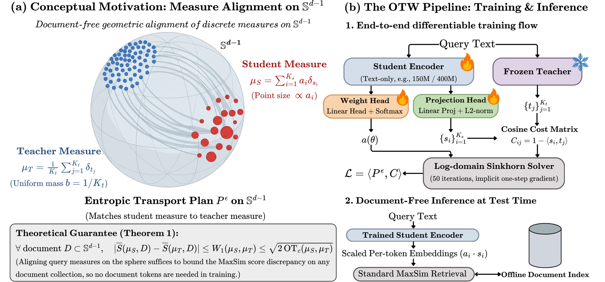

# ColNanoVDR-Q: multi-vector query towers

[← back to the main README](../README.md) · [NanoVDR-Q](nanovdr-q.md) · [NanoVDR-D](nanovdr-d.md)

The state of the art in visual document retrieval is **late interaction**:
ColPali-style models that emit a *set* of vectors per input and score by MaxSim.
They are also where the asymmetry is worst. The query side of such a system runs
a multi-billion-parameter vision-language model on plain text, every time.

ColNanoVDR replaces exactly that. A small text encoder emits a set of vectors
inside the teacher's late-interaction space, so the teacher's existing page
index is scored unchanged and nothing multi-billion runs at query time.

## Document-free distillation

The obvious way to distil a late-interaction model is to score query-document
pairs and match the scores. That needs documents, which means encoding pages
with the teacher, which is the expensive thing we are trying to avoid.

The observation this family is built on is that you do not need them. A query is
a *measure* on the unit sphere, and if the student's measure is close to the
teacher's in transport distance, then the MaxSim score they assign is close
**for every possible document**, whether or not that document was ever seen.
Aligning the query measures therefore bounds the retrieval error outright, and
no page image needs to be encoded during training.

<p align="center">
  
</p>

### The objective: OTW

The student and the teacher do not produce the same number of tokens, and there
is no correspondence between them, so there is nothing to regress token-to-token
onto. Both sides are treated as discrete measures on the sphere instead:

```
mu_S = sum_i a_i d(s_i)      mu_T = sum_j b_j d(t_j)      c(s, t) = 1 - <s, t>

L = <P*, C>       P* = argmin_{P in U(a, b)} <P, C> - eps H(P)
```

Two details do the work:

**Balanced transport.** Both marginals are enforced, so every student token must
carry its mass. A one-sided relaxation lets student tokens go dead, and a
Chamfer-style precision term collapses the student onto a few teacher atoms;
constraining both sides removes both failure modes at once.

**The W: a learned student marginal.** `a_i` is a softmax over per-token logits
from a weight head reading the pre-projection hidden states, instead of being
uniform. A student with fewer atoms than the teacher can then put more mass on
the tokens that deserve it. Those weights are **folded into the vectors at
encode time**, so a plain MaxSim consumer reproduces the weighted score with no
weight-aware scoring code.

That folding is why the emitted vectors are deliberately **not unit length**:
per-query token norms sum to 1. Do not re-normalise them.

## Models

| Model | Params | Teacher | Width | v1 | v2 | v3 | Retention | Comments |
|---|---|---|---|---|---|---|---|---|
| [ColNanoVDR-Q-Ettin400M-ColQwen35-320-ML](https://huggingface.co/nanovdr/ColNanoVDR-Q-Ettin400M-ColQwen35-320-ML) | 395M | ColQwen3.5-4.5B | 320 | 91.16 | 62.08 | 56.65 | **98.1%** | • Ettin-400M.<br />• Highest retention of the family. |
| [ColNanoVDR-Q-Ettin150M-ColQwen35-320-ML](https://huggingface.co/nanovdr/ColNanoVDR-Q-Ettin150M-ColQwen35-320-ML) ⭐ | 150M | ColQwen3.5-4.5B | 320 | 90.67 | 60.01 | 55.06 | 96.1% | • Ettin-150M.<br />• 30x smaller than its teacher.<br />• Start here. |
| [ColNanoVDR-Q-Ettin150M-Vultron45B-320-ML](https://huggingface.co/nanovdr/ColNanoVDR-Q-Ettin150M-Vultron45B-320-ML) | 150M | Vultron-4.5B | 320 | 91.28 | 64.96 | 58.30 | 97.3% | • Same recipe, different teacher. |
| [ColNanoVDR-Q-Ettin150M-Tomoro8B-320-ML](https://huggingface.co/nanovdr/ColNanoVDR-Q-Ettin150M-Tomoro8B-320-ML) | 150M | Tomoro-8B | 320 | 89.95 | 60.61 | 54.87 | 95.7% | • 59x smaller than its teacher. |
| [ColNanoVDR-Q-Ettin150M-ColVec4B-640-ML](https://huggingface.co/nanovdr/ColNanoVDR-Q-Ettin150M-ColVec4B-640-ML) † | 150M | ColVec1.1-4b | 640 | 90.27 | 64.03 | 59.08 | 97.4% | • Non-commercial, inherited from the teacher. |
| [ColNanoVDR-Q-Ettin150M-ColVec8B-640-ML](https://huggingface.co/nanovdr/ColNanoVDR-Q-Ettin150M-ColVec8B-640-ML) † | 150M | ColVec1.1-8b | 640 | 90.86 | 65.37 | 60.10 | 97.5% | • Non-commercial, inherited from the teacher.<br />• Strongest absolute scores. |

<sub>NDCG@5 on ViDoRe, query side scored in isolation against teacher-encoded
pages, which attributes all error to the tower. Retention = student / teacher,
averaged over v1-v3. Rows distilled from different teachers are **not**
comparable to each other: each is measured against its own ceiling. † inherits
the webAI Non-Commercial License.</sub>

That the same recipe transfers across five teachers, two architectures and two
widths without touching a page image is the point of the table. Retention is
95.7-98.1% in every case.

## Usage

Requires `sentence-transformers>=6.0` and `transformers>=5.0`. Retrieval is two
stages: the teacher builds the index once, offline, and the tower then answers
every query online.

### Step 1 (offline, once): index pages with the teacher

The only stage where a vision-language model runs. If you already serve the
matching teacher, **skip this entirely** -- your index is already in the right
space and does not need rebuilding.

```python
import torch
from colpali_engine.models import ColQwen3_5, ColQwen3_5Processor

TEACHER = "athrael-soju/colqwen3.5-4.5B-v3"
teacher = ColQwen3_5.from_pretrained(
    TEACHER, dtype=torch.bfloat16, attn_implementation="sdpa", device_map="cuda"
).eval()
processor = ColQwen3_5Processor.from_pretrained(TEACHER)

page_embeddings = []
with torch.no_grad():
    for batch in batches_of(page_images, 4):
        inputs = processor.process_images(images=batch).to(teacher.device)
        page_embeddings.extend(teacher(**inputs))     # (n_patches, 320) each
```

### Step 2 (online, per query): encode and score

```python
from sentence_transformers import MultiVectorEncoder

model = MultiVectorEncoder("nanovdr/ColNanoVDR-Q-Ettin150M-ColQwen35-320-ML",
                           trust_remote_code=True)

q = model.encode_query(["What was the revenue growth in Q3 2024?"])
# list of (n_tokens, 320) arrays, weights already folded in

scores = model.similarity(q, page_embeddings)   # meanMaxSim
```

No teacher, no image processor, no GPU on this path.

Three things change results if ignored:

- **Pass the raw query, with no instruction prefix.** The teacher's targets were
  cached through its own query processor; the student was trained to reproduce
  them from bare query text, and every number above was measured that way.
- **Do not re-normalise the output.** The learned weights are already folded in.
- **Scoring is `meanmaxsim`**, MaxSim over document tokens per query token then
  *averaged* over query tokens. The summed ColBERT variant changes the ranking
  once per-token weights are in play.

## How it is trained

```bash
# 1. cache the teacher's query token sets (ragged: tokens + offsets + status)
nanovdr-cache --data $DATA_ROOT/queries --out $CACHE_ROOT/colqwen35/queries.h5 \
    --kind query_tokens --teacher colqwen35

# 2. train
python -m nanovdr.train.query --config configs/query/ettin150m_colqwen35_otw.yaml
```

Supported teacher keys are `colqwen35`, `vultron`, `tomoro8b`, `colvec4b` and
`colvec8b`. They ship with three different loading conventions, which
`nanovdr.teacher.MultiVectorTeacher` hides.

The released recipe: `eps = 0.05`, 50 Sinkhorn iterations, AdamW one-cycle, peak
LR 3e-4 with 3% warmup, effective batch 512 (128 x 4 accumulation), 10 epochs,
on 1.49M queries (711K English plus 778K MarianMT translations into five
Latin-script European languages).

### The tower

Ettin encoder → bias-free linear projection to the teacher's width → per-token
L2 normalisation → weight head. Two details are load-bearing and easy to get
wrong:

- **The projection has no bias.** A bias survives L2 normalisation as a fixed
  direction every token is pulled towards, which is the collapse balanced
  transport exists to prevent.
- **`[CLS]`, `[SEP]` and padding are dropped** from the token set. They carry no
  query content, and leaving them in gives transport somewhere cheap to put
  mass. Training and retrieval use the same mask.

## Packaging a checkpoint

```bash
python packaging/build_colnanovdr_package.py --ckpt outputs/run/best --out dist/ColNanoVDR-...
python packaging/verify_colnanovdr_package.py --ckpt outputs/run/best --pkg dist/ColNanoVDR-...
```

The package is four sentence-transformers modules: Transformer, Dense,
Normalize, and `ColNanoVDRWeighting`. The ordering is the interesting part --
`Dense` pins its output to `mv_embeddings` rather than overwriting
`token_embeddings`, so the *pre-projection* hidden states survive to the last
module, where the weight head reads them exactly as it does in training.

The verifier is not optional. It re-encodes the same queries through both the
checkpoint and the package and compares element-wise; all six released towers
reproduce their checkpoint to within 3e-08.

## Limitations

- **The document side is still the teacher.** ColNanoVDR replaces the query
  tower only. Page storage is unchanged, so the saving is query-time compute,
  not index size.
- **Teacher-locked, and more strictly than elsewhere.** Both the teacher and the
  width must match, and a multi-vector tower cannot consume a single-vector
  index at all.
- **English plus five Latin-script European languages.** Non-Latin scripts are
  untested.
- **Bounded by the teacher.** Nothing in the objective lets a student exceed the
  model it was aligned to.
- **Two towers are non-commercial.** The `ColVec` rows inherit the webAI
  Non-Commercial License from their teacher.
