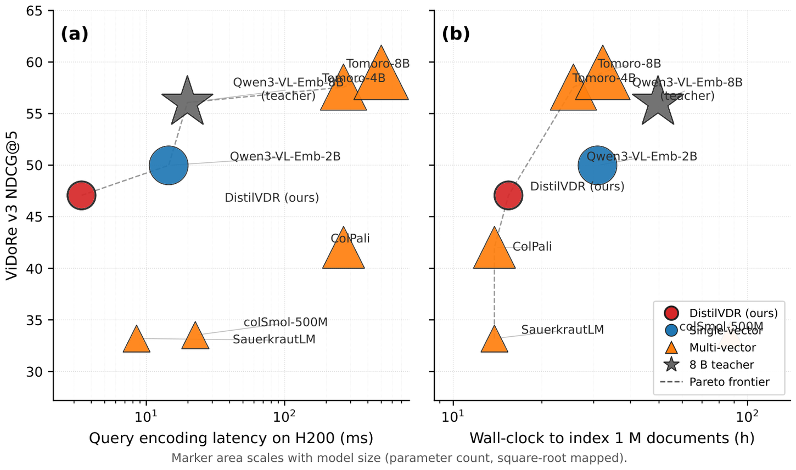
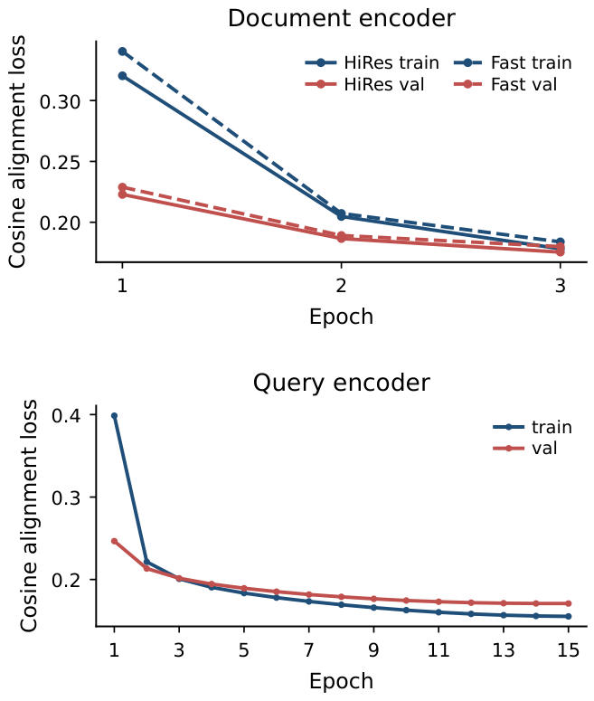

# NanoVDR-D: document towers

[← back to the main README](../README.md) · [NanoVDR-Q](nanovdr-q.md) · [ColNanoVDR-Q](colnanovdr-q.md)

A branch of the project, added in [DistilVDR](https://arxiv.org/abs/2608.10636).

[NanoVDR-Q](nanovdr-q.md) removes the teacher from the query path but still
needs it once per page. A document tower removes it there too: a 457M student
encodes pages into the same frozen space, so a deployed pair has nothing
multi-billion in it at any point.

<p align="center">
  
</p>

<sub>Panel (b) is the one this family is about: wall-clock to index one million
pages. Indexing is the cost a document tower attacks, and it is the cost that
scales with the corpus rather than with traffic.</sub>

## Models

| Model | Params | Teacher | Width | Tiles | v1 | v2 | v3 | Avg | Comments |
|---|---|---|---|---|---|---|---|---|---|
| [NanoVDR-D-HiRes-Qwen3VL8B-4096](https://huggingface.co/nanovdr/NanoVDR-D-HiRes-Qwen3VL8B-4096) ⭐ | 457M | 8B | 4096 | 6 + thumbnail | 82.81 | 55.34 | 47.07 | **61.74** | • InternViT-300M + ModernBERT-base.<br />• 36.8 pages/s, 3.07 GB VRAM.<br />• Take this one for dense reports. |
| [NanoVDR-D-Fast-Qwen3VL8B-4096](https://huggingface.co/nanovdr/NanoVDR-D-Fast-Qwen3VL8B-4096) | 457M | 8B | 4096 | 2 + thumbnail | 81.34 | 54.95 | 43.66 | 59.98 | • Same architecture and recipe, smaller tile budget.<br />• 99.0 pages/s, 2.10 GB VRAM.<br />• Take this one for volume. |

<sub>Scored end to end, paired with NanoVDR-Q-DistilBERT-Qwen3VL8B-4096-ML,
527M total. Throughput is one H200 at batch size 8 in bf16.</sub>

### All four combinations retrieve

Because both towers land in the same frozen space, either can be swapped for
the corresponding half of the teacher:

|  | teacher documents | **student documents** |
|---|---|---|
| **teacher queries** | 71.05, the 8B ceiling | 65.02, indexing 7x cheaper |
| **student queries** | 66.36, queries on one CPU thread | **61.74, no teacher anywhere** |

<sub>Average NDCG@5 over ViDoRe v1+v2+v3 against Qwen3-VL-Embedding-8B.</sub>

## Usage

```python
from sentence_transformers import SentenceTransformer   # >= 5.4

doc = SentenceTransformer("nanovdr/NanoVDR-D-HiRes-Qwen3VL8B-4096", trust_remote_code=True)
doc_emb = doc.encode(pages)                             # PIL page images -> (N, 4096)
```

It also loads through plain `transformers`, which has no version floor and
returns the same vectors:

```python
from transformers import AutoModel, AutoImageProcessor

doc = AutoModel.from_pretrained("nanovdr/NanoVDR-D-HiRes-Qwen3VL8B-4096", trust_remote_code=True).eval()
proc = AutoImageProcessor.from_pretrained("nanovdr/NanoVDR-D-HiRes-Qwen3VL8B-4096", trust_remote_code=True)
doc_emb = doc.encode(pages, proc, batch_size=4)
```

`proc` is a `NanoVDRDocImageProcessor`, not a stock single-view processor. It
tiles the page and returns the `tile_mask` the model needs alongside
`pixel_values`, so substituting a generic image processor silently changes what
the model sees.

## Tiling

A page does not reach the model as one 448px view. Text in a scanned report
survives downsampling badly, so the processor cuts the page into
aspect-ratio-matched tiles plus a thumbnail, zero-pads to a fixed tile budget
and pairs the result with a mask.

That rule lives in `processing_doc.py` alone -- training, evaluation and the
released checkpoint all import the same file, so it cannot drift between them.
`tests/test_processing.py` asserts the processor is bit-identical to the
preprocessing the released weights were trained on, across five page aspect
ratios.

The tile budget is the one knob: `HiRes` takes 6 tiles, `Fast` takes 2. That is
the entire difference between the two released rows, and it buys 2.7x indexing
throughput for 1.8 average points.

## How it is trained

Same objective as the query side, against cached teacher *page* embeddings:

```bash
nanovdr-cache --data $DATA_ROOT/base_711k --out $CACHE_ROOT/teacher_8b/base_711k.h5 --kind image
torchrun --nproc_per_node=2 -m nanovdr.train.doc --config configs/doc/hires_8b.yaml
```

<p align="center">
  
</p>

Caching the 1.20M-image mixture against the 8B teacher is the expensive part,
and it is paid once; the student then trains without the teacher resident.

## Verification

`packaging/verify_doc_package.py` is how we established that the released
weights reproduce our internal evaluation rather than merely loading:

```
500 pages of ViDoRe arxivqa, NanoVDR-D-HiRes-Qwen3VL8B-4096
cosine(student page, teacher page)      : 0.7959 mean
NDCG@5  teacher queries x teacher pages : 86.91
NDCG@5  teacher queries x student pages : 83.07   (95.6% retention)
```

The cosine number is worth reading next to the NDCG one. A mean page cosine of
0.80 sounds loose, but retrieval only needs the *ranking* to survive, and it
largely does -- which is the argument for aligning representations rather than
chasing reconstruction.

## Limitations

- **One teacher, one width.** Only the 8B / 4096-d configuration is released.
- **Single vector per page.** A document tower for late interaction is not part
  of this family; [ColNanoVDR](colnanovdr-q.md) keeps the teacher on the
  document side.
- **Bounded by the teacher**, as everywhere in this project.
