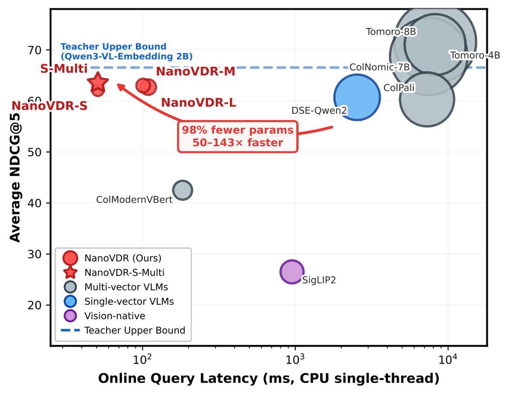
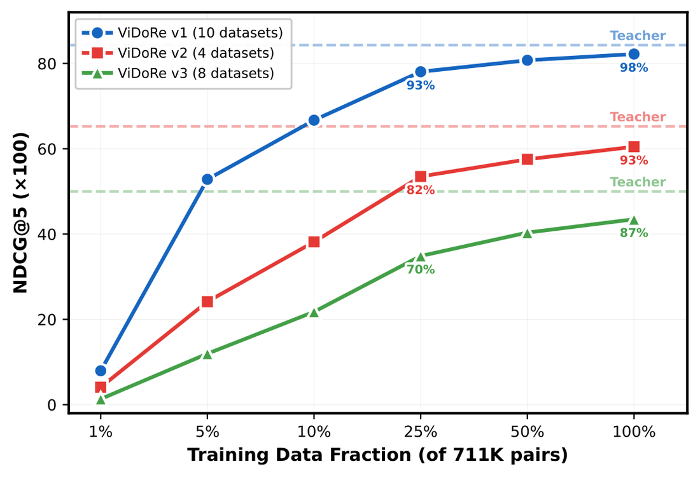

# NanoVDR-Q: single-vector query towers

[← back to the main README](../README.md) · [NanoVDR-D](nanovdr-d.md) · [ColNanoVDR-Q](colnanovdr-q.md)

The main line of the project, and what the
[NanoVDR paper](https://arxiv.org/abs/2603.12824) (EMNLP 2026 Main) is about.

A query is short text and carries no image. A NanoVDR-Q tower is a plain text
encoder that maps it into a frozen VLM's embedding space, so retrieval stays a
dot product against pages the teacher indexed, and no vision model runs at
query time.

<p align="center">
  
</p>

<sub>Figure from the paper, using the pre-rename model names: `NanoVDR-S` is
DistilBERT, `-M` is BERT-base, `-L` is ModernBERT, and `S-Multi` is the
DistilBERT tower on the multilingual mixture (now `-ML`). Marker area scales
with parameter count.</sub>

## Models

| Model | Params | Teacher | Width | v1 | v2 | v3 | CPU latency | Comments |
|---|---|---|---|---|---|---|---|---|
| [NanoVDR-Q-DistilBERT-Qwen3VL2B-2048-ML](https://huggingface.co/nanovdr/NanoVDR-Q-DistilBERT-Qwen3VL2B-2048-ML) ⭐ | 69M | 2B | 2048 | 82.2 | 61.9 | 46.5 | **51 ms** | • DistilBERT.<br />• The paper's headline model.<br />• Best quality per millisecond. |
| [NanoVDR-Q-BERT-Qwen3VL2B-2048-ML](https://huggingface.co/nanovdr/NanoVDR-Q-BERT-Qwen3VL2B-2048-ML) | 112M | 2B | 2048 | 82.5 | 62.8 | 47.5 | 101 ms | • BERT-base.<br />• Highest v2 and v3 in the 2B family. |
| [NanoVDR-Q-ModernBERT-Qwen3VL2B-2048-ML](https://huggingface.co/nanovdr/NanoVDR-Q-ModernBERT-Qwen3VL2B-2048-ML) | 151M | 2B | 2048 | 82.2 | 63.1 | 47.1 | 109 ms | • ModernBERT-base.<br />• 8192-token context if your queries are long. |
| [NanoVDR-Q-DistilBERT-Qwen3VL2B-2048](https://huggingface.co/nanovdr/NanoVDR-Q-DistilBERT-Qwen3VL2B-2048) | 69M | 2B | 2048 | 82.2 | 60.5 | 43.5 | 51 ms | • English-only training mixture.<br />• Use `-ML` above unless you have a reason. |
| [NanoVDR-Q-BERT-Qwen3VL2B-2048](https://huggingface.co/nanovdr/NanoVDR-Q-BERT-Qwen3VL2B-2048) | 112M | 2B | 2048 | 82.1 | 62.2 | 44.7 | 101 ms | • English-only counterpart of the BERT row. |
| [NanoVDR-Q-ModernBERT-Qwen3VL2B-2048](https://huggingface.co/nanovdr/NanoVDR-Q-ModernBERT-Qwen3VL2B-2048) | 151M | 2B | 2048 | 82.4 | 61.5 | 44.2 | 109 ms | • English-only counterpart of the ModernBERT row. |
| [NanoVDR-Q-DistilBERT-Qwen3VL8B-4096-ML](https://huggingface.co/nanovdr/NanoVDR-Q-DistilBERT-Qwen3VL8B-4096-ML) | 70M | 8B | 4096 | 84.68 | 64.30 | 50.09 | 51 ms | • From DistilVDR, not the NanoVDR paper.<br />• The only query tower that pairs with a [document tower](nanovdr-d.md). |

<sub>NDCG@5 on ViDoRe. The 2B rows are as published in the NanoVDR paper. The
8B row is scored under query-side isolation and is not comparable to them.
Latency is one query on one CPU thread including tokenisation, and tracks the
backbone: the width of the output head is marginal beside it.</sub>

## Usage

```python
from sentence_transformers import SentenceTransformer

query = SentenceTransformer("nanovdr/NanoVDR-Q-DistilBERT-Qwen3VL2B-2048-ML")
q_emb = query.encode(["What was the revenue growth in Q3 2024?"])   # (1, 2048), L2-normalised

scores = q_emb @ doc_emb.T
```

`doc_emb` must come from the matching teacher, or from a
[NanoVDR-D tower](nanovdr-d.md) targeting the same teacher and width. Pages are
indexed offline, once.

### Do not add an instruction prefix

Pass the raw query. The teacher's targets were cached *with* an instruction, but
the student was trained to reproduce those targets **from the bare query text**,
and every number above was measured that way. Prepending an instruction at
inference moves the input off the distribution the tower was fitted on.

## How it is trained

One objective, and nothing else in it:

```
loss = 1 - cos(student_vector, teacher_vector)
```

Teacher query targets are cached once before training, so the teacher never runs
during it. There are no relevance labels, no negatives and no contrastive term,
which is why this tower can be trained alone and paired afterwards.

```bash
nanovdr-cache --data $DATA_ROOT/queries --out $CACHE_ROOT/teacher_8b/queries.h5 --kind query
python -m nanovdr.train.query --config configs/query/distilbert_8b.yaml
```

The tower is a text backbone, mean pooling, and one linear projection into the
teacher's width. An MLP projector was tried and did not help: against a strong
teacher the extra capacity buys nothing, and against a weaker one it zero-pads
the rear dimensions.

### Data efficiency

<p align="center">
  
</p>

Alignment is cheap in data terms because the target is dense: every query
carries a full teacher embedding rather than one bit of relevance. Most of the
quality arrives well before the full mixture is consumed, which is the practical
argument for distilling into a new teacher's space rather than retraining a
retriever from labels.

## Packaging a checkpoint

```bash
python packaging/build_query_package.py --ckpt outputs/run/best --out dist/NanoVDR-Q-...
```

The result is a four-module sentence-transformers layout -- Transformer,
Pooling, Dense, Normalize -- that `SentenceTransformer(repo_id)` loads with no
dependency on this repository.

## Limitations

- **English plus five Latin-script European languages** on the `-ML` rows, via a
  MarianMT translation pipeline. Non-Latin scripts are untested.
- **Text-only.** Image-conditioned queries are out of scope.
- **Bounded by the teacher.** Nothing in the objective lets a student exceed the
  model it was aligned to on the side it replaces.
- **Teacher-locked.** The output space is the teacher's; see the naming rule in
  the [main README](../README.md#how-a-model-is-named).
